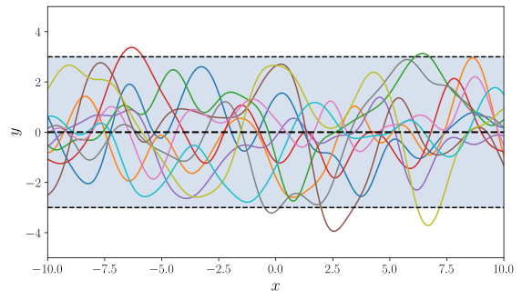
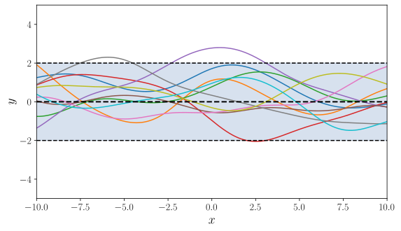
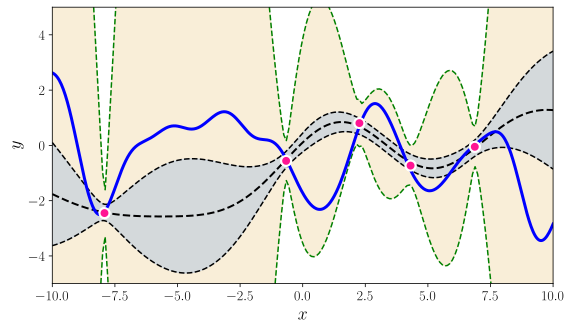
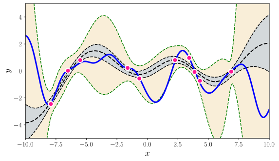

# gp-martingales

[Uncertainty quantification using martingales for misspecified Gaussian
processes](https://arxiv.org/abs/2006.07368)\
Willie Neiswanger, Aaditya Ramdas\
Algorithmic Learning Theory (ALT), 2021\
_arXiv:2006.07368_

We study uncertainty quantification for Gaussian processes (GPs) under misspecified
priors, with an eye towards Bayesian Optimization (BO). GPs are widely used in BO
because they easily enable exploration based on posterior uncertainty bands. However,
this convenience comes at the cost of robustness: a typical function encountered in
practice is unlikely to have been drawn from the assumed prior, in which case
uncertainty estimates can be misleading, and the resulting exploration can be
suboptimal.

We present a frequentist approach to GP/BO uncertainty quantification. We utilize the GP
framework as a working model, but do not assume correctness of the prior.  We instead
construct a confidence sequence (CS) for the unknown function using martingale
techniques. There is a necessary cost to achieving robustness: if the prior was correct,
posterior GP bands are narrower than our CS. Nevertheless, when the prior is wrong, our
CS is statistically valid and can empirically outperform standard GPs, in terms of both
coverage and utility for BO.

<p align="center">
    
    
    <br>
    
    
</p>

**Top row**: Two GPs, A (left) and B (right).
**Bottom row**: Assume a function (dark blue line) is drawn from GP A, but we use GP B
as a prior model.  The posterior GP (grey bands) and our martingale CS (tan bands) are
shown, given 5 observations (left) and 10 observations (right).


## Installation

This repo requires Python 3.6+. To install Python dependencies, run:
```
$ pip install -r requirements.txt
```

## Examples

1. To produce results for a misspecified prior, comparing our CS with a GP posterior, run:
```
$ python examples/viz_misspecified_prior.py
```

2. To produce results for a correctly specified prior, comparing our CS with a GP
posterior, run:
```
$ python examples/viz_correct_prior.py
```

3. To run the CS-LCB algorithm for a misspecified prior, run:
```
$ python examples/cslcb_misspecified_prior.py
```

4. To run the GP-LCB algorithm for a misspecified prior, run:
```
$ python examples/gplcb_misspecified_prior.py
```

5. To run the CS-LCB algorithm for a correctly specified prior, run:
```
$ python examples/cslcb_correct_prior.py
```

6. To run the GP-LCB algorithm for a correctly specified prior, run:
```
$ python examples/gplcb_correct_prior.py
```

7. To visualize samples drawn from the two GPs in the figure above (top row), run:
```
$ python examples/plot_priors.py
```


## Citation
Please cite [our paper](https://arxiv.org/abs/2006.07368) if you use code from this repo:
```
@inproceedings{neiswanger2021uncertainty,
  title={Uncertainty quantification using martingales for misspecified Gaussian processes},
  author={Neiswanger, Willie and Ramdas, Aaditya},
  booktitle={Algorithmic Learning Theory},
  year={2021},
  organization={PMLR}
}
```
