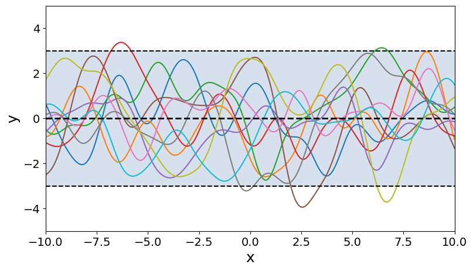
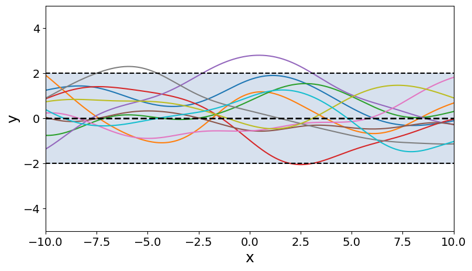
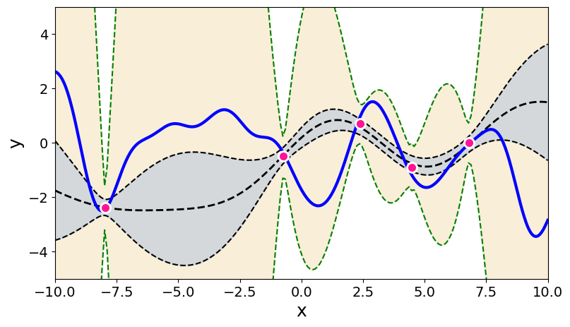
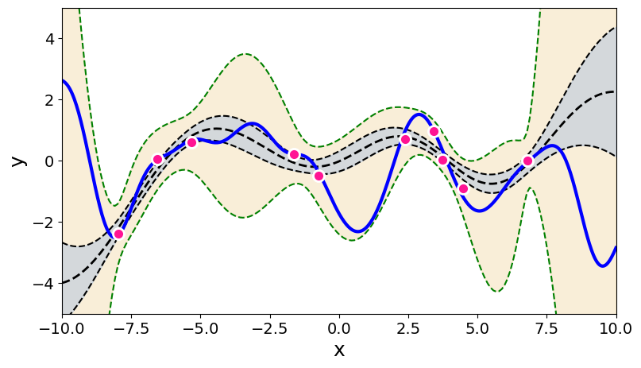

# gp-martingales

[Uncertainty quantification using martingales for misspecified Gaussian
processes](https://https://arxiv.org/abs/2006.07368)\
Willie Neiswanger, Aaditya Ramdas\
_arXiv:2006.07368_

We study uncertainty quantification for Gaussian processes (GPs) under misspecified
priors, with an eye towards Bayesian Optimization (BO). GPs are widely used in BO
because they easily enable exploration based on posterior uncertainty bands. However,
this convenience comes at the cost of robustness: a typical function encountered in
practice is unlikely to have been drawn from the assumed prior, in which case
uncertainty estimates can be misleading, and the resulting exploration can be
suboptimal.

We present a frequentist approach to GP/BO uncertainty quantification. We utilize the GP
framework as a working model, but do not assume correctness of the prior.  We instead
construct a confidence sequence (CS) for the unknown function using martingale
techniques. There is a necessary cost to achieving robustness: if the prior was correct,
posterior GP bands are narrower than our CS. Nevertheless, when the prior is wrong, our
CS is statistically valid and empirically outperforms standard GP methods, in terms of
both coverage and utility for BO.

<p align="center">
    
    
    <br>
    
    
</p>

**Top plots**: Two GPs, A (left) and B (right). Assume a function (dark blue line in
bottom plots) was drawn from GP A.
**Bottom plots**: Results using (misspecified) GP B as a prior model. The posterior GP
(grey bands) and our martingale CS (tan bands) are shown, given 5 observations (left) and
10 observations (right).


## Installation

This repo requires Python 3.6+. To install Python dependencies, run:
```
$ pip install -r requirements.txt
```
